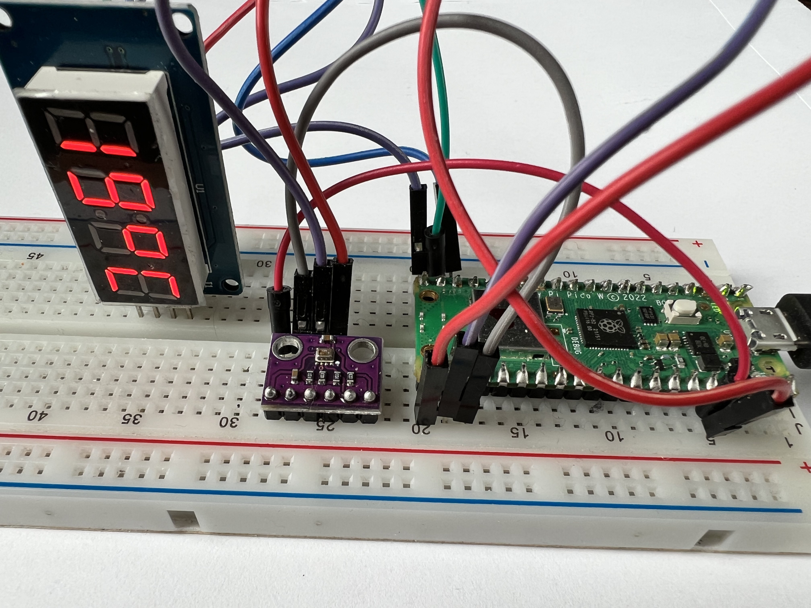

# IoT Lab CLT 2023

Willkommen im IoT-Lab auf den Chemnitzer Linuxtagen 2023!

Im Workshop bauen wir eine Internet-Wetterstation, die ihre Messungen auf 
einem Display anzeigt und über das Internet an einen Server schickt. Dort 
werden die Daten gesammelt und visualisiert.

Ablauf:

0. Einleitung
1. [Hello World](docs/01-hello) (30 min)
2. [Temperatursensor auslesen](docs/02-read-sensor) (30 min)
3. [Ausgabe auf einem Display](docs/03-display-data) (15 min)
4. [Daten an den Server senden](docs/04-send-data) (30 min)
5. [Feedback ausgeben (Bonus)](docs/05-receive-feedback) (15 min)
6. Zusammenfassung 

## Infomaterial

* [Raspberry Pico Pi Microcontroller](docs/Pico_Pi.md)
* [Breadboard](docs/Breadboard.md)
* Kurzanleitung [CircuitPython](docs/CircuitPython.md)
* [LED Ampel](docs/LEDS.md)
* [BMP280 Temperatursensor](docs/BMP280.md)
* [TM1637 7-Segment Display](docs/Display.md)

## Backend

Als [Backend](backend/) nutzen wir einen einfachen
[Go-Service](backend/temperature-monitor), der die Daten der Devices per MQTT
empfängt und als Metriken in Prometheus bereitstellt und mit Grafana
visualisiert.

## Autor

Copyright 2023 by Jan Delgado, License MIT.

