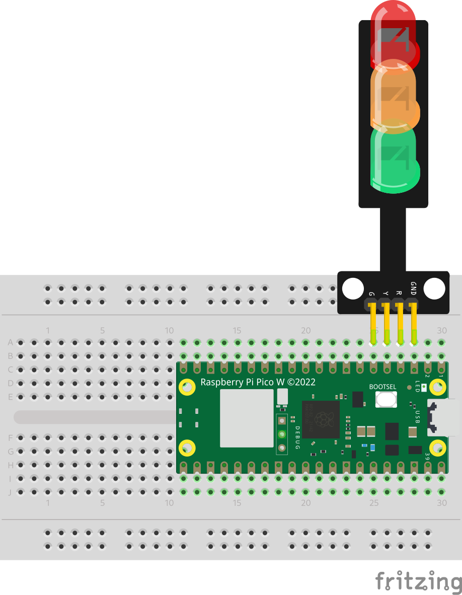

# Hello World

Als erstes schließen wir einige Leuchtdioden (LED) an den Mikrocontroller an,
und lassen diese blinken.

## Aufbau

** Wichtig:** Bevor Bauteile angeschlossen werden, oder die Schaltung verändert 
wird, unbedingt durch ziehen des USB-Steckers die Verbindung zum Computer trennen.

Das Bauteil das aussieht wie eine kleine Ampel enthält 3 LEDs, die wir nun wie
folgt an den Mikrocontroller anschließen:

| LED-Ampel | Pico Pi Signal | Pin |
|-----------|----------------|-----|
| GND       | GND            | 3   |
| R         | GP3            | 4   |
| Y         | GP4            | 5   |
| G         | GP5            | 6   |

Das genaue Pinout des Raspberry Pico Pi findet ihr [hier](../Pico_Pi.md).



## Say Hello

Wir nutzen nun die [CicruitPython REPL](../CircuitPython.md#repl), um die LEDs
zu steuern. Dazu die `Thonny` IDE starten und im REPL Prompt (hinter `>>>`) die
Befehle eingeben. Mit `CTRL+C` ein evtl. laufends Programm stoppen und mit
`CTRL+D` kann der Interpreter neu gestartet werden.

```python
import board
import digitalio

led = digitalio.DigitalInOut(board.GP3)
led.direction = digitalio.Direction.OUTPUT

led.value = True
led.value = False
```

Das Programm initialisiert den `GPIO` (General Purpose Input/Output) Port 3, an 
den die rote LED angeschlossen ist als digitalen `OUTPUT`. Durch zuweisen
eines Wertes (`led.value = True`) wird der GPIO Port eingeschaltet. Ist
der Port eingeschaltet, so liegt dort eine Spannung von ca. 3,3V an, und die LED
leuchtet. Ist der Port ausgeschaltet (`led.value = False`), erlischt die LED.

## Blink

Als nächstes laden wir ein komplettes Programm auf den Raspberry Pico Pi und
lassen LEDs blinken.

Folgendes Programm muss dazu in einer Datei mit dem Namen [code.py](code.py)
auf den Raspberry Pi Pico [kopiert
werden](../CircuitPython.md#programmdatei-kopieren):

```python
import time
import board
import digitalio

led_rot = digitalio.DigitalInOut(board.GP3)
led_rot.direction = digitalio.Direction.OUTPUT
led_gelb = digitalio.DigitalInOut(board.GP4)
led_gelb.direction = digitalio.Direction.OUTPUT
value = True

while True:
    led_rot.value = value
    led_gelb.value = not value
    value = not value
    time.sleep(0.5)
```

### Bonus 

Auf dem Mikrocontroller ist die Bibliothek `JLed` installiert, mit der sich
einfach LED-Effekte realisieren lassen. 

```python
from jled import JLed
import board

led1 = JLed(board.GP2).fade_on(1000).forever()
led2 = JLed(board.GP3).blink(250,750).forever()

while True:
    led1.update()
    led2.update()
```

Was ist der Unterschied zum ersten Beispiel?

[Weiter zu Aufgabe 2](../02-read-sensor/README.md)

