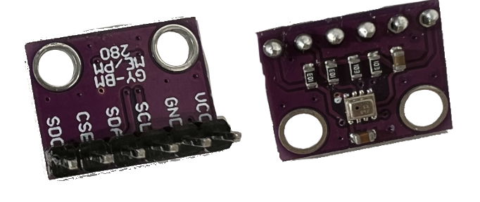

# Temperatursensor auslesen

Als nächstes schließen wir den Temperatursensor an und lesen Temperatur und
Luftdruck aus, und geben die Werte aus.

## Sensor BMP280



Der BMP280 Sensor kann die aktuelle Temperatur und den Luftdruck messen.
Angeschlossen wird er entweder über den
[I²C](https://de.wikipedia.org/wiki/I%C2%B2C)- oder
[SPI](https://de.wikipedia.org/wiki/Serial_Peripheral_Interface) Bus. Wir
werden den I²C Bus nutzen. I²C ist ein serieller Datenbus, der es erlaubt,
mehrere Geräte an nur 2 Anschlüssen des Mikrocontrollers zu betreiben.  Jedes
Gerät hat eine eigene Bus-Adresse und kann so von anderen Geräten am Bus
unterschieden werden.

## Aufbau

** Wichtig:** Bevor Bauteile angeschlossen werden, oder die Schaltung verändert 
wird, unbedingt durch ziehen des USB-Steckers die Verbindung zum Computer trennen.


Der Sensor befindet sich auf einer kleinen Platine, die wir über den I²C Bus an
den Mikrocontroller anschließen. Der Sensor wird wie auf der Abbildung
beschrieben an den Mikrokontroller angeschlossen. Dazu wird der Sensor in das
Breadboard gesteckt, und die Anschlüsse werden mit dem Mikrocontroller
verkabelt:

| GY-BME/PM280 | Pico Pi Signal | Pin |
|--------------|----------------|-----|
| VCC          | 3V3(OUT)       | 36  |
| GND          | GND            | 23  |
| SCL          | GP17/I2C0SCL   | 22  |
| SDA          | GP16/I2C0SDA   | 21  |

Das genaue Pinout des Raspberry Pico Pi findet ihr [hier](../Pico_Pi.md).

## Sensor auslesen

Mit folgendem Code kann der Sensor direkt in der CircuitPython REPL getestet
werden:

```python
import busio
import board
from adafruit_bmp280 import Adafruit_BMP280_I2C as BMP280

i2c = busio.I2C(board.GP17, board.GP16)
sensor = BMP280(i2c, 118)

print(sensor.temperature)
print(sensor.pressure)
```
 
Zunächst erzeugen wir ein Objekt (`i2c`) zur Kommunikation über I²C mit dem
Sensor, der an die GPIO Pins `GP16` und `GP17` angeschlossen ist. Zur Erzeugung
der Instanz des BMP280 Sensors (`sensor`) übergeben wir zum einen das I²C
Objekt `i2c` als auch die Adresse (118) des Sensor (die Adresse des Sensor ist
fest und wird vom Hersteller vorgegeben). Über die
[Properties](https://www.geeksforgeeks.org/python-property-decorator-property)
`temperature` und `pressure` der `BMP280` Klasse können wir nun die Temperatur
und den Luftdruck auslesen und mit `print` ausgeben.

[Weiter zu Aufgabe 3](../03-display-data/README.md)

