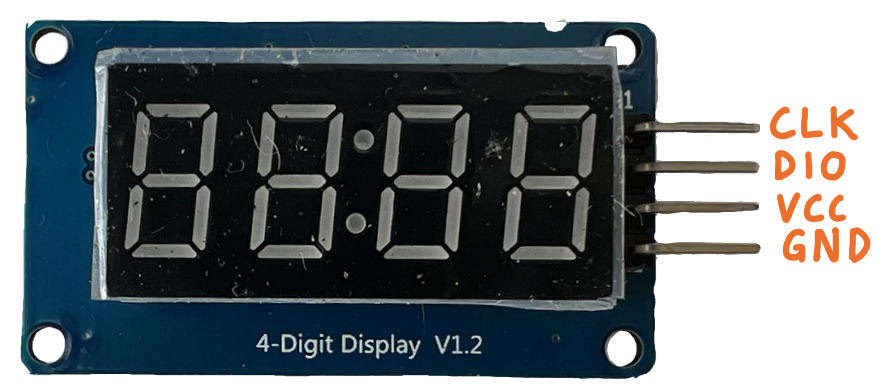

# Daten ausgeben

Nachdem wir den BMP280 Sensor angeschlossen haben, stellen wir die aktuelle
Temperatur auf einen Display dar, das aus  7-Segmentanzeigen aufgebaut ist. Das
Display verfügt über einen `TM1637` Treiber-IC und wird über eine passende
[Bibliothek](https://github.com/bablokb/circuitpython-tm1637) angesteuert.



## Aufbau

** Wichtig:** Bevor Bauteile angeschlossen werden, oder die Schaltung verändert
wird, unbedingt durch ziehen des USB-Steckers die Verbindung zum Computer trennen.

Das Display wird wie folgt an den Raspberry Pi Pico ageschlossen:

| Display(TM1637) | Pico Pi Signal | Pin |
|-----------------|----------------|-----|
| CLK             | GP14           | 19  |
| DIO             | GP15           | 20  |
| VCC             | 3V3(OUT)       | 36  |
| GND             | GND            | 18  |

Das genaue Pinout des Raspberry Pico Pi findet ihr [hier](../Pico_Pi.md).


## Erster Test

Wir nutzen wieder die [CicruitPython REPL](../CircuitPython.md#repl), um das Display
interaktiv zu testen:

```python
import board
from TM1637 import TM1637

display = TM1637(board.GP14,board.GP15)
display.hex(0xcafe)
display.scroll("hello world")
display.temperature(23)
```

Das Programm erzeugt ein `TM1637` Objekt (`display`), konfiguriert mit den GPIO
Ports `GP14` (CLK) und `GP15` (DIO).  Über das Objekt können nun mit Methoden
wie `hex` (Ausgabe Hexzahlen), `scroll` (Ausgabe Laufschrift) oder
`temperature` (Ausgabe einer Temperatur) Daten ausgegeben werden.

## Ausgabe der Temperatur auf dem Display

Erweitere das Programm aus Aufgabe 2, so dass nun forlaufend die aktuelle
Temperatur auf dem Display ausgegeben wird. Nutze die Python `round`-Funktion,
um den Temperaturwert vom Sensor, der als Fließkommazahl zurückgegeben wird, in
eine Ganzzahl zu runden, damit der Wert durch die `temperature()`
Methode ausgegeben werden kann.

Das Programm kann direkt in der `Thonny` IDE eingegeben werden.
Speichere das Programm unter dem Namen `code.py` auf dem Microcontroller.

```python
import busio
import board
import time

from adafruit_bmp280 import Adafruit_BMP280_I2C as BMP280
from TM1637 import TM1637

i2c = busio.I2C(board.GP17, board.GP16)
sensor = BMP280(i2c, 118)
display = TM1637(board.GP14,board.GP15)
counter = 1

def sensor_lesen(sensor):
    """temperatur und druck vom sensor lesen und als tupel zurückgeben"""
    <<<Code ergänzen>>>

def daten_ausgeben(display, counter, temperature, pressure):
    """daten auf der Konsole und dem Display ausgeben"""
    <<<Code ergänzen>>>

while True:
    temperature, pressure = sensor_lesen(sensor)
    daten_ausgeben(display, counter, temperature, pressure)
    time.sleep(1)
    counter += 1
```

## Links

* [TM1637 Python API](https://github.com/mcauser/micropython-tm1637/blob/master/README.md)

[Weiter zu Aufgabe 4](../04-send-data/README.md)
