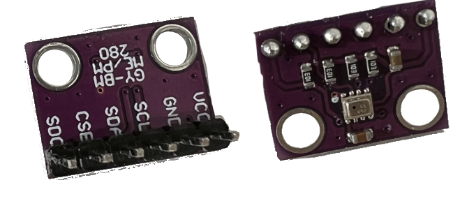

# BMP280 Temperatur und Drucksensor

Der BMP280 Sensor misst Temperatur Luftdruck. Er verfügt über Anschlüsse für
den [I²C](https://de.wikipedia.org/wiki/I%C2%B2C)- und
[SPI](https://de.wikipedia.org/wiki/Serial_Peripheral_Interface) Bus. Wir
werden den I²C Bus nutzen. I²C ist ein serieller Datenbus, der es erlaubt,
mehrere Geräte an nur 2 Anschlüssen des Mikrocontrollers zu betreiben.  Jedes
Gerät hat eine eigene Bus-Adresse und kann so von anderen Geräten am Bus
unterschieden werden. Für den Anschluss an den Mikrocontroller mit I²C sind die
Anschlüsse `SCL` (Serial Clock) und `SDA` (Serial Data) vorgesehen.

