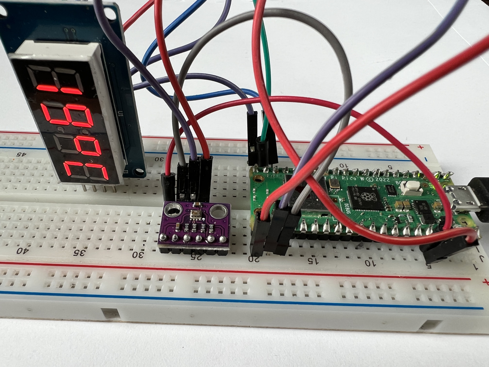

# Das Breadboard

Auf dem  [Breadboard](https://en.wikipedia.org/wiki/Breadboard) werden die
Bauteile montiert und verkabelt.

Image attribution: [CC BY-SA 2.0](https://commons.wikimedia.org/wiki/File:400_points_breadboard.jpg)

## Verdrahtungsschema

Image attribution: [CC BY-SA 3.0](https://commons.wikimedia.org/wiki/File:Breadboard_scheme.svg)

## Beispiel

