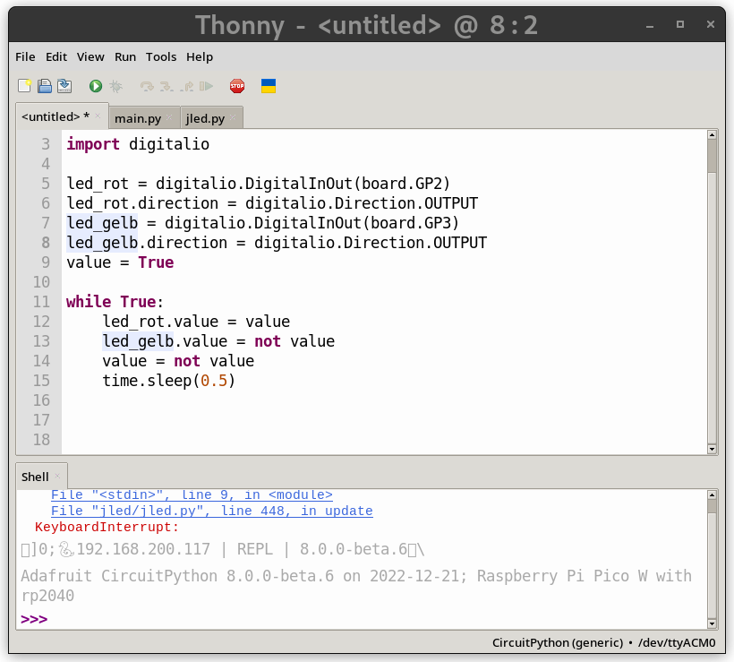
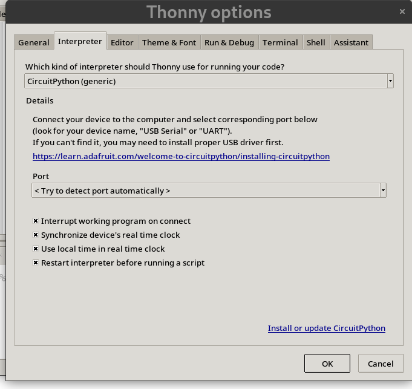
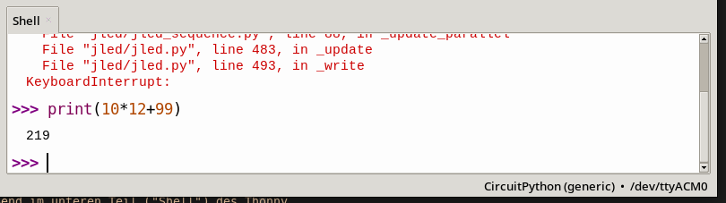

# CircuitPython und Thonny IDE

[CircuitPython](https://circuitpython.org/) ist eine Variante der Programmiersprache
Python, die direkt auf Mikrocontrollern läuft. Im Gegensatz zur Programmierung
in C/C++ spart man sich eine aufwändige Toolchain, und kommt in den Genuss 
schneller Turn-Around Zeiten - ideal zum experimentieren.

Um mit dem Python-Interpreter zu kommunizieren gibt es mehrere Möglichkeiten,
wir werden die `Thonny` IDE nutzen.

<!-- vim-markdown-toc GFM -->

* [REPL](#repl)
* [Thonny](#thonny)
* [REPL mit screen](#repl-mit-screen)
    * [Programmdatei kopieren](#programmdatei-kopieren)
* [Weitere Links](#weitere-links)

<!-- vim-markdown-toc -->

## REPL

REPL steht für `Repeat Evaluate Print Loop`. Die Python REPL erlaubt die
interaktive Benutzung von Python. Befehle werden direkt eingegeben, und vom
Python Interpreter ausgeführt. Die REPL eignet sich damit sehr gut zum
interaktiven Erkunden und Experimentieren.

* https://en.wikipedia.org/wiki/Read%E2%80%93eval%E2%80%93print_loop

## Thonny



[Thonny](https://thonny.org/) ist eine einfache Python IDE, die direkt mit dem
Python Interpreter auf dem Microcontroller kommunizieren kann.  Dazu muss
`Thonny` zunächst konfiguriert werden:

Im Menüpunkt `Run` die Option `Configure Interpreter...` wählen und im Menü zur
Auswahl des Interpreters `CircuitPython (generic)` wählen.



Hat alles funktioniert, kann man anschließend im unteren Teil ("Shell") des Thonny
Fensters die REPL des Mikrocontrollers nutzen:



Im oberen Teil der Thonny IDE stelle einen Editor zur Verfügung, mit dem man
Dateien direkt auf dem Mikrocontroller editieren kann. Nachdem Änderungen mit
`Save` (CTRL+S) gespeichert worden sind, kann das Pythonskript mit `Run current
script` (F5) im `Run` Menü gestartet werden. Wichtig ist, dass die Datei `code.py` 
genannt wird, da CircuitPython diese Datei beim Start automatisch ausführt.

## REPL mit screen

Das `screen` Kommando kann als Alternative zu `Thonny` genutzt werden, um eine
interaktive Verbindung zum Mikrocontroller herzustellen:

```shell
$ screen /dev/ttyACM0
<CTRL+C>
Traceback (most recent call last):
  File "code.py", line 18, in <module>
  ...
KeyboardInterrupt:

Code done running.
Auto-reload is on. Simply save files over USB to run them or enter REPL to disable.

Press any key to enter the REPL. Use CTRL-D to reload.

Adafruit CircuitPython 8.0.0-beta.6 on 2022-12-21; Raspberry Pi Pico with rp2040
>>> print("hello")
hello
<CTRL+A>\
```

Nachdem mit `screen` eine Verbindung zum Mikrocontroller, der über den
seriellen Port `/dev/ttyACM0` erreichbar ist, hergestellt wurde, wird durch
Drücken von `CTRL+C` das laufende Python-Programm unterbrochen. Danach findet
man sich in der Python REPL wieder, erkennbar am `>>>` Prompt. Hier kann man
nun Python Kommandos eingeben, die auf dem Mikrocontroller ausgeführt werden.
Am Ende wird die Screen Session mit der Tastenfolge `CTRL+A \` beendet.

### Programmdatei kopieren

Eine REPL eignet sich nicht gut, um größere Programme zu erstellen. Diese
werden daher mit einem Editor erstellt und auf den Mikrocontroller kopiert.
CircuitPython führt beim Start automatisch eine Pythondatei mit dem Namen
`code.py` aus.

Wird der Raspberry PI Pico per USB an einen Rechner angeschlossen, so erscheint
dieser, ähnlich einem USB-Stick, auch als Speichergerät. Programme werden direkt 
in das Verzeichnis kopiert, unter den der Mikrokontroller gemountet wurde 
(nach dem Namen `CIRCUITPY` suchen).

```shell
$ lsblk
NAME                                          MAJ:MIN RM   SIZE RO TYPE  MOUNTPOINTS
...
sdb                                             8:16   1     1M  0 disk
└─sdb1                                          8:17   1     1M  0 part  /run/media/jdelgado/CIRCUITPY
$ ls /run/media/jdelgado/CIRCUITPY
boot_out.txt  lib  code.py
```

Im Beispiel wurde der Mikrocontroller nach `/run/media/jdelgado/CIRCUITPYTHON`
gemountet. 
## Weitere Links

* https://github.com/thonny/thonny

