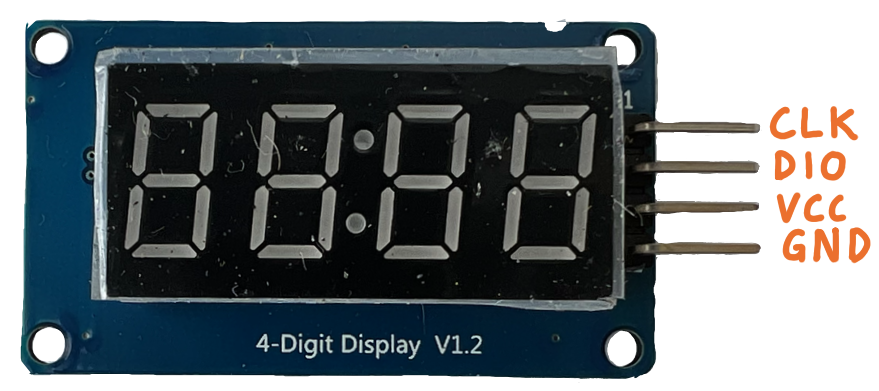
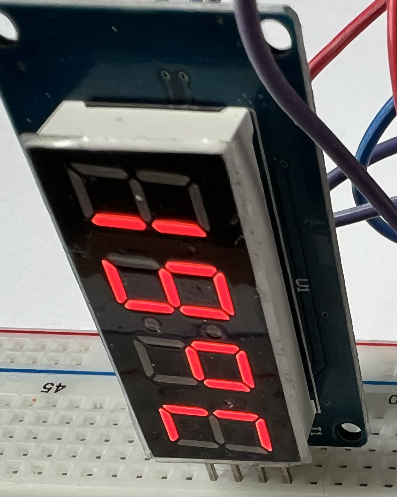

# Das Display

Das Display besteht aus vier 7-Segement Anzeigegelementen und wird von einem
TM1637 Treiber angesteuert. Die Verbindung zum Mikrocontroller erfolgt über
eine 2-Draht Seriellverbindung (Signale `DIO` und `CLK`). Die Anschlüsse
`VCC` (Betriebsspannung) und `GND` (Masse) dienen der Stromversorgung.

    
    

