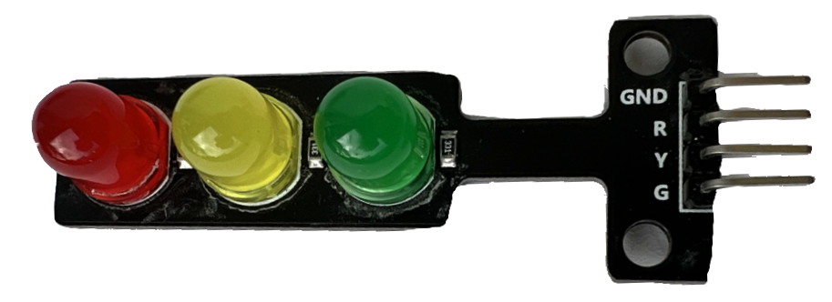

# LEDs

Eine LED ([Light Emitting Diode](https://de.wikipedia.org/wiki/Leuchtdiode)) ist
ein Halbleiterelement, das unter Spannung Licht ausstrahlt. Leuchtdioden gibt
es in verschiedenen Farben, Über einen Vorwiderstand können sie direkt an den
Mikrocontroller angeschlossen werden. Das Ampelboard das wir hier verwenden, hat
die notwendigen Vorwiderstände direkt integriert und kann deshalb sofort
angeschlossen werden. Für jede LED (Rot `R`, Gelb `Y`, Grün `G`) gibt es einen
Anschluss, `GND` ist der Masseanschluss.

