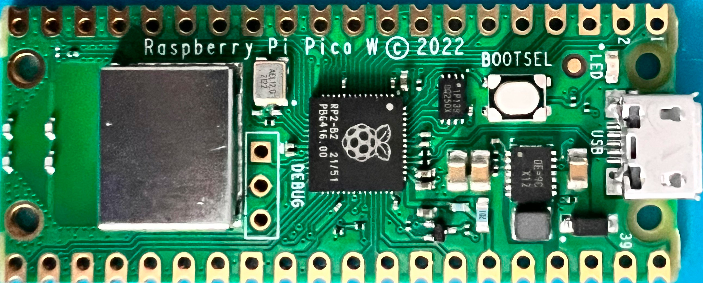

# Raspberry Pi Pico W

<!-- vim-markdown-toc GFM -->

* [Features](#features)
* [Specs](#specs)
* [Pinout](#pinout)
* [Links](#links)

<!-- vim-markdown-toc -->

## Features

* RP2040 microcontroller with 2MB of flash memory
* On-board single-band 2.4GHz wireless interfaces (802.11n)
* Micro USB B port for power and data (and for reprogramming the flash)
* 40-pin 21mm×51mm 'DIP' style 1mm thick PCB with 0.1" through-hole pins also with edge castellations
* Exposes 26 multi-function 3.3V general purpose I/O (GPIO)
* 23 GPIO are digital-only, with three also being ADC capable
* Can be surface-mounted as a module
* 3-pin Arm serial wire debug (SWD) port
* Simple yet highly flexible power supply architecture
* Various options for easily powering the unit from micro USB, external supplies or batteries
* High quality, low cost, high availability
* Comprehensive SDK, software examples and documentation

## Specs

For full details of the RP2040 microcontroller please see the RP2040 Datasheet
book. Key features include: 

* Dual-core cortex M0+ at up to 133MHz
* On-chip PLL allows variable core frequency
* 264kB multi-bank high performance SRAM
* External Quad-SPI flash with eXecute In Place (XIP) and 16kB on-chip cache
* High performance full-crossbar bus fabric
* On-board USB1.1 (device or host)
* 30 multi-function general purpose I/O (four can be used for ADC)
* 1.8-3.3V I/O voltage
* 12-bit 500ksps analogue to digital converter (ADC)
* Various digital peripherals
* 2 × UART, 2 × I2C, 2 × SPI, 16 × PWM channels
* 1 × timer with 4 alarms, 1 × real time clock
* 2 × programmable I/O (PIO) blocks, 8 state machines in total
* Flexible, user-programmable high-speed I/O
* Can emulate interfaces such as SD card and VGA

[Quelle](https://datasheets.raspberrypi.com/picow/pico-w-datasheet.pdf)

## Pinout

Raspberry Pico W pinout Diagram, by raspberrypi.com, is licensed under CC-BY-SA.

## Links

* https://www.raspberrypi.com/documentation/microcontrollers/raspberry-pi-pico.html
* https://datasheets.raspberrypi.com/picow/pico-w-datasheet.pdf

